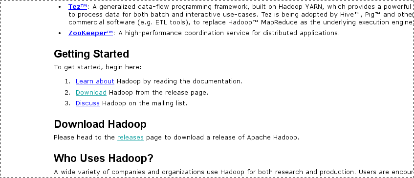
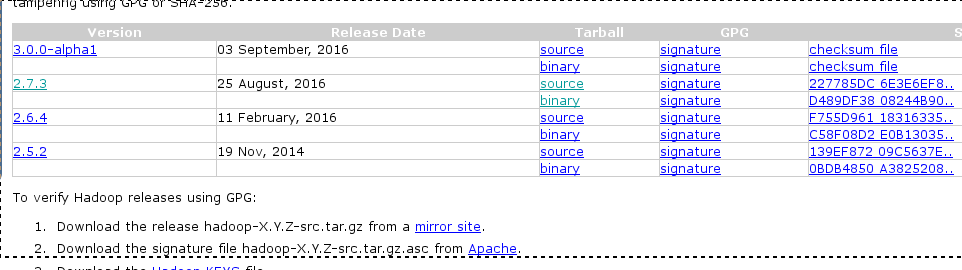

# Projeto Ozone
O projeto consiste na utilização do paradigma MapReduce para a implementação de algoritmos para manipulação de dados a partir de satélites de monitoramento climático. Trata-se de um grande volume dados, os quais devem ser extraídos e tratados. Dentre as métricas a serem implementadas destacam-se média aritmética, valores mínimo e máximo e desvio padrão. Os algoritmos implementados preveem a necessidade de seleção de intervalos de tempo e de espaço para a extração de amostras e/ou dados específicos de uma dada região.

Para conseguir executar os arquivos do projeto, é necessário alguma versão do Java Development Kit (recomenda-se o 8) e Hadoop, que é uma plataforma de computação distribuída para processamento de grandes quantidades de dados.

## Instalação das Ferramentas
Todos os comandos listados aqui foram executados no Debian 8 (Jessie), deve funcionar funcionar sem mais problemas em distribuições derivadas.

**Java Development Kit**

É recomendável que ao invés da plataforma comunitária e de código aberto do java, use-se a priprietária. Então, vamos remover as versões comunitárias do java:
```
apt-get remove --purge openjdk-*
```
Adição dos Repositórios da Oracle:
```
echo "deb http://ppa.launchpad.net/webupd8team/java/ubuntu trusty main" | tee /etc/apt/sources.list.d/webupd8team-java.list
echo "deb-src http://ppa.launchpad.net/webupd8team/java/ubuntu trusty main" | tee -a /etc/apt/sources.list.d/webupd8team-java.list
```
Permissão de chave para o gerenciador de pacotes:
```
apt-key adv --keyserver keyserver.ubuntu.com --recv-keys EEA14886
```
Atualização dos repositórios:
```
apt-get update
```
Instalação do Java JDK 8:
```
apt-get install oracle-java8-installer
```
Para testar se a instalação foi um sucesso:
```
java -version ou javac -version
```

**Servidor SSH**
```
apt-get install ssh
```

**Apache Hadoop**

É aconselhável criar um usuário para o hadoop. Como root, execute:
```
addser hadoop
```
Defina a senha para seu usuário.

Após criar o usuário para a ferramenta, fazer login via terminal com o usuário para podermos entrar com as permissões do servidor ssh.
```
ssh-keygen -t rsa
cat ~/.ssh/id_rsa.pub >> ~/.ssh/authorized_keys
chmod 0600 ~/.ssh/authorized_keys
```
Para adicionar o localhost, na área dos hosts conhecidos, fazer login via ssh da seguinte maneira:
```
ssh localhost
exit (para sair)
```
Após isso, acessar (http://hadoop.apache.org/), deslocar-se até o tópico "Getting Started" e clicar em downloads como na imagem a seguir:



Você será redirecionado para a página de download. Com isso, é recomendável que seja feito o download do pacote "binary" da versão estável mais atual disponível. Na imagem exemplo, é a versão 2.7.3.



Para concluir o download, só seguir com as instruções recomdadas pela próxima página.


Com a conclusão do download, mover o pacote para o diretório raiz do usuário hadoop.

Para extrair o pacote e renomer a pasta recém extraída.
```
tar -zxvf hadoop-2.7.3.tar.gz
mv hadoop-2.7.3.tar.gz hadoop
```
Agora, se faz necessário customizar alguns dos arquivos recefentes a configuraçao do hadoop.
Para começar, vamos editar o ~/.bashrc e adicinar os campos:
```
export HADOOP_HOME=/home/hadoop/hadoop
export HADOOP_CLASSPATH=/usr/lib/jvm/java-8-oracle/lib/tools.jar
export HADOOP_INSTALL=$HADOOP_HOME
export HADOOP_MAPRED_HOME=$HADOOP_HOME
export HADOOP_COMMON_HOME=$HADOOP_HOME
export HADOOP_HDFS_HOME=$HADOOP_HOME
export YARN_HOME=$HADOOP_HOME
export HADOOP_COMMON_LIB_NATIVE_DIR=$HADOOP_HOME/lib/native
export PATH=$PATH:$HADOOP_HOME/sbin:$HADOOP_HOME/bin
export HADOOP_OPTS="-Djava.library.path=$HADOOP_HOME/lib/native"
```
Agora vamos editar o ~/hadoop/etc/hadoop/hadoop-env.sh. Precimos alterar o campo "export JAVA_HOME" para:
```
export JAVA_HOME=/usr/lib/jvm/java-8-oracle
```
Editar o ~/hadoop/etc/hadoop/core-site.xml:
```
<configuration>
    <property>
        <name>fs.defaultFS</name>
        <value>hdfs://localhost:9000</value>
    </property>
</configuration>
```
Editar o hadoop/etc/hadoop/hdfs-site.xml:
```
<configuration>
    <property>
        <name>dfs.replication</name>
        <value>1</value>
    </property>
</configuration>
```
Editar o hadoop/etc/hadoop/mapred-site.xml.template
```
<configuration>
    <property>
        <name>mapreduce.framework.name</name>
        <value>yarn</value>
    </property>
</configuration>
```
Editar o hadoop/etc/hadoop/yarn-site.xml:
```
<configuration>
    <property>
        <name>yarn.nodemanager.aux-services</name>
        <value>mapreduce_shuffle</value>
    </property>
</configuration>
```
Agora, é necessário formatar o namenode:
```
cd ~
hdfs namenode -format
```
Para testar o funcionamento da instalação, executar os comandos abaixo e acessar (http://127.0.0.1:50070):
```
start-dfs.sh
start-yarn.sh
```
Para parar os data node e name nome:
```
stop-yarn.sh
stop-dfs.sh
```

## Execução de uma aplicação Teste

Para testar o hadoop, vamos executar a aplicação presente em [WordCount](examples/WordCount.java).

Compilando o arquivo e gerando seu .jar:
```
hadoop com.sun.tools.javac.Main WordCount.java
jar cf wc.jar WordCount*.class
```
Agora, partiremos do principio que:
- **Input da app**: /hadoop/tmp.txt;
- **Output da app**: /hadoop/tmpResult;
Ambos diretórios se encontram no HDFS

Executando o .jar:
```
hadoop jar wc.jar WordCount /hadoop/tmp.txt /hadoop/tmpResult
```
Verificando o resultado
```
hadoop fs -cat /hadoop/tmpResult/part-r-00000
```

Caso todo o processo tenha sido realizado com sucesso, deve haver uma saída condizente com a entrada teste.

## Referências
(https://hadoop.apache.org/docs/r2.7.2/hadoop-mapreduce-client/hadoop-mapreduce-client-core/MapReduceTutorial.html#Example:_WordCount_v2.0)
